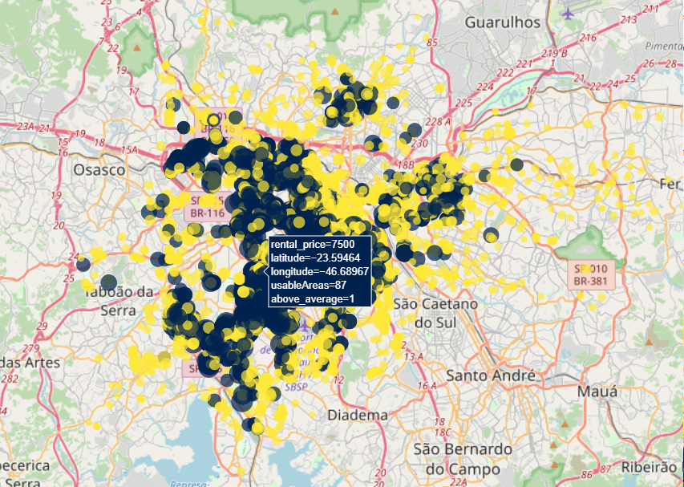

# 
 <b> Análise de Dados Imobiliários da cidade de São Paulo</b> 

 
##  💻 Sobre o projeto

O projeto deste módulo trata de uma aplicação prática do conteúdo de Técnicas de Programação I no python.

Foram analisados dados de aproximadamente 10 mil apartamentos da cidade de São Paulo.

Nesta análise, nosso objeto de estudo é a variável de preço de aluguel em função dos demais descritores.

## Autores:
- <a href= "https://www.linkedin.com/in/bruno-r-s-souza/"> Bruno Souza </a> 
- <a href= "https://www.linkedin.com/in/jorgeluizfigueira/"> Jorge Luiz Figueira </a> 

## Objetivo
Realizar um EDA (Exploratory Data Analysis) com os conhecimentos obtidos até o momento (Pandas e Numpy).

## Base de Dados
Cada grupo foi responsável por buscar uma base de dados de seu interesse.

## Avaliação
Para a avaliação serão considerados os seguintes pontos

- Entendimento do contexto em que se encaixa a base de dados
- Uso dos conhecimentos obtidos no decorrer do módulo
- Apresentação das características do conjunto de dados fornecido, destacando sua visão geral acerca do conjunto de dados e tecendo críticas e comentários
- Identificação e discussão de missings ou outliers na base de dados
- Outras análises que sejam pertinentes
