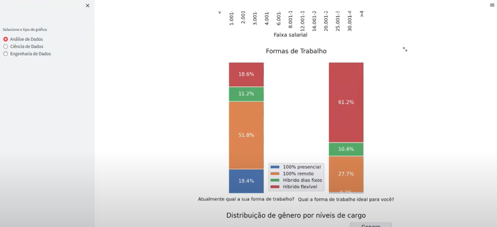

# 
 <b> Uma visão geral dos diferentes perfis de profissionais de dados </b> 
  

##  💻 Sobre o projeto

Este repositório trata do projeto do Módulo IV (Técnicas de Programação II) do programa DiversidadeTech.
Proposta: Explorar uma de base de dados, de temática livre, e apresentar os achados com as bibliotecas de visualização de dados aprendidas ao longo do módulo. 
A saber, foram estudadas as bibliotecas: Matplotlib, Seaborn, Plotly e Streamlit (bônus).

Para atingir esse objetivo, foram escolhidos para investigação os dados abertos da pesquisa State of Data Brazil 2021. A pesquisa conduzida pelo DataHackers e pela consultoria global Bain & Company tem por objetivo realizar um mapeamento do mercado de dados brasileiro.

Os dados fornecidos permitem realizar uma análise com diferentes recortes. Devido ao curto escopo deste módulo optou-se por extrair uma visão generalista dos dados demográficos, carreira e conhecimentos dos profissionais de dados do mercado atual.

A organização do projeto dividiu-se em duas partes. A primeira, em um arquivo jupyter notebook (EDA.ipynb) para testes e exploração dos dados. E a segunda, um compilado dos achados construído com Streamlit (streamlit.py) 
