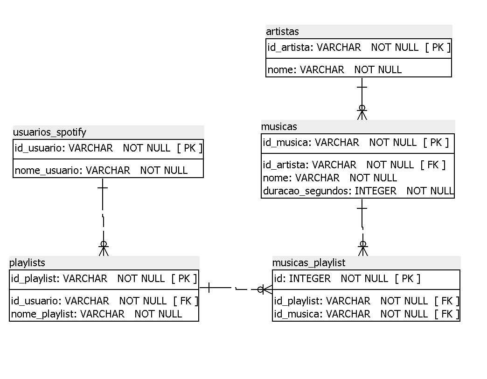

# <p align="center"> <b> Consumindo dados do Spotify e armazenando com o Postgresql </b> 

 
##  💻 Sobre o projeto

To-do

## 🛠 Tecnologias

Esse projeto foi desenvolvido na linguagem Python, utilizando as bibliotecas: *spotipy*, como cliente API do Spotify; *psycopg2* como  adaptador de banco de dados; e o *PostgreSQL* sendo o banco de dados.
    
Também serviram como tecnologias auxiliares o *SQL Power Architect*, usado durante a modelagem do banco, e o cliente SQL *DBeaver* que ajudou durante a escrita das instruções SQL de consulta e manipulação. 

### 📲 Requerimentos

- **Instale as bibliotecas necessárias a partir do PyPI:**
  ```shell
  pip install -r requirements.txt
  ```